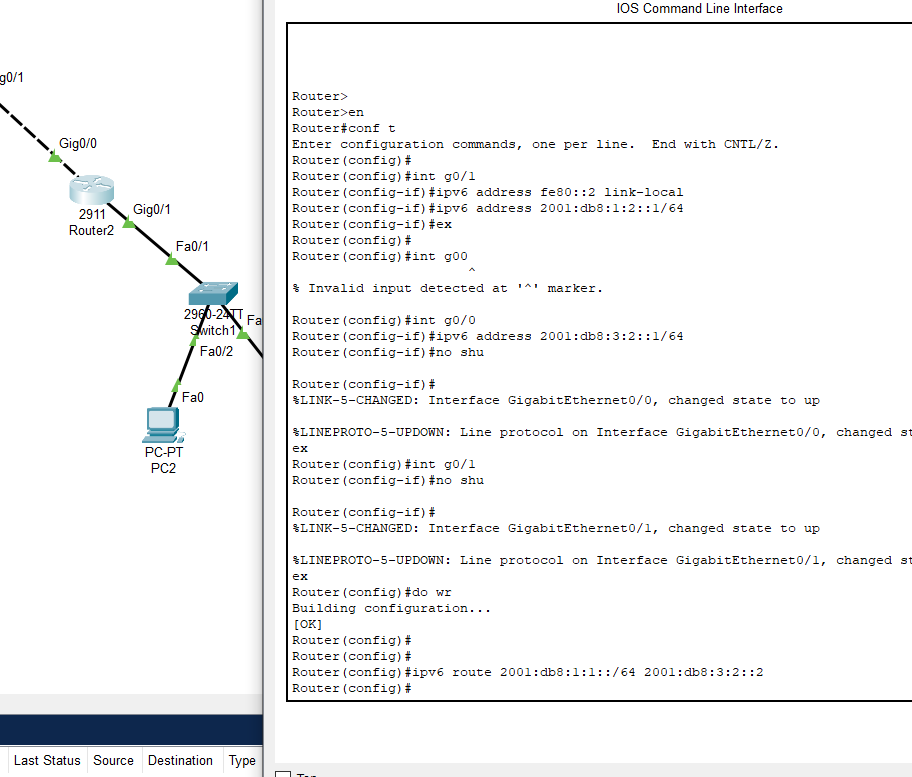
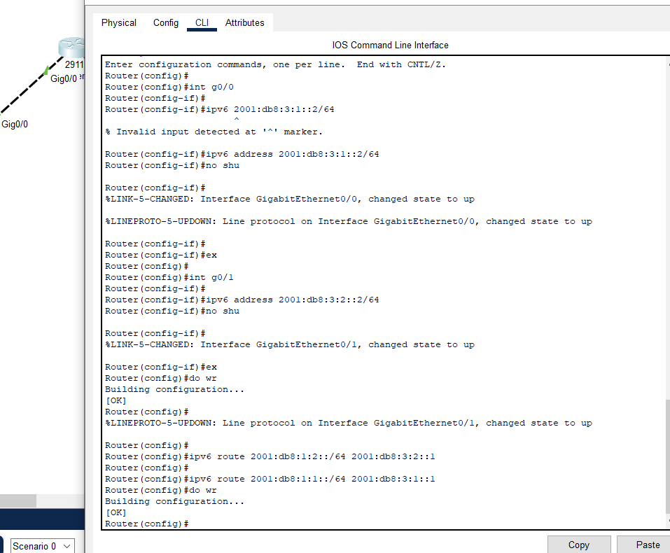
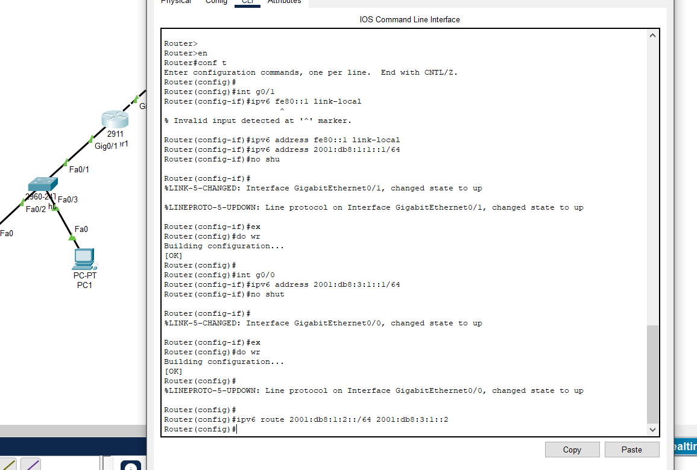

---

# 📘 IPv6 Static Routing — Simple Topology

## 📡 Overview

This project demonstrates how to configure **IPv6 static routing** on a small network topology consisting of:

* 3 Routers
* 2 LAN networks (Left LAN & Right LAN)
* 2 Switches
* 4 PCs (PC0–PC3)

All routers are connected in a triangle shape, and each LAN is connected to its nearest router.

The goal of this setup is to allow IPv6 communication between all PCs across the entire topology using manually configured static routes.

---

## 🖼️ Network Topology

The topology contains the following IPv6 networks:

### 🔹 Left LAN

* **Network:** `2001:db8:1:1::/64`
* **Devices:** PC0, PC1
* **Connected to:** Router1 → Switch

### 🔹 Right LAN

* **Network:** `2001:db8:1:2::/64`
* **Devices:** PC2, PC3
* **Connected to:** Router2 → Switch

### 🔹 Router Links

* **Router1 ↔ Middle Router:** `2001:db8:3:1::/64`
* **Router2 ↔ Middle Router:** `2001:db8:3:2::/64`

---

## ⚙️ Static Routing Summary

To enable full communication:

### **Router1**

Add routes pointing to Router2 LAN and Router2 link via the Middle Router:

```
ipv6 route 2001:db8:1:2::/64 2001:db8:3:1::2
ipv6 route 2001:db8:3:2::/64 2001:db8:3:1::2
```

### **Router2**

Add routes pointing to Router1 LAN and Router1 link via the Middle Router:

```
ipv6 route 2001:db8:1:1::/64 2001:db8:3:2::2
ipv6 route 2001:db8:3:1::/64 2001:db8:3:2::2
```

### **Middle Router**

Add routes to both LANs:

```
ipv6 route 2001:db8:1:1::/64 2001:db8:3:1::1
ipv6 route 2001:db8:1:2::/64 2001:db8:3:2::1
```

---

## 🧪 Connectivity Testing

After configuration:

* PCs on the left should successfully **ping** PCs on the right (and vice versa) using IPv6.
* `proof.png` contains testing results.

Example test command (from PC0):

```
ping 2001:db8:1:2::10
```

---

## 📁 Files Included

```
/assets/
│── topology.png   # Network diagram
│── LEFTRCLI.png   # Router1 CLI output
│── MIDRCLI.png    # Middle Router CLI output
│── RIGHTRCLI.png  # Router2 CLI output
│── proof.png      # Ping test results
```





---

## ROUTER1 (LEFT)
! ===== Interface Config =====

conf t
!
interface GigabitEthernet0/0
 ipv6 enable
 ipv6 address 2001:db8:3:1::1/64
 ipv6 address fe80::1 link-local
 no shutdown
!
interface GigabitEthernet0/1
 ipv6 enable
 ipv6 address 2001:db8:1:1::1/64
 ipv6 address fe80::1 link-local
 no shutdown
!
exit

! ===== Static Routes =====
ipv6 route 2001:db8:1:2::/64 2001:db8:3:1::2
ipv6 route 2001:db8:3:2::/64 2001:db8:3:1::2
!
end
write
---
## ROUTER 0 (MID)
! ===== Interface Config =====

conf t
!
interface GigabitEthernet0/0
 ipv6 enable
 ipv6 address 2001:db8:3:1::2/64
 ipv6 address fe80::2 link-local
 no shutdown
!
interface GigabitEthernet0/1
 ipv6 enable
 ipv6 address 2001:db8:3:2::2/64
 ipv6 address fe80::2 link-local
 no shutdown
!
exit

! ===== Static Routes =====
ipv6 route 2001:db8:1:1::/64 2001:db8:3:1::1
ipv6 route 2001:db8:1:2::/64 2001:db8:3:2::1
!
end
write
---
---
## ROUTER 2 (RIGHT)
! ===== Interface Config =====

conf t
!
interface GigabitEthernet0/0
 ipv6 enable
 ipv6 address 2001:db8:3:2::1/64
 ipv6 address fe80::3 link-local
 no shutdown
!
interface GigabitEthernet0/1
 ipv6 enable
 ipv6 address 2001:db8:1:2::1/64
 ipv6 address fe80::3 link-local
 no shutdown
!
exit

! ===== Static Routes =====
ipv6 route 2001:db8:1:1::/64 2001:db8:3:2::2
ipv6 route 2001:db8:3:1::/64 2001:db8:3:2::2
!
end
write
---
